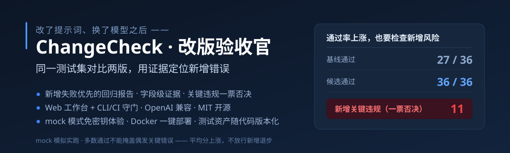
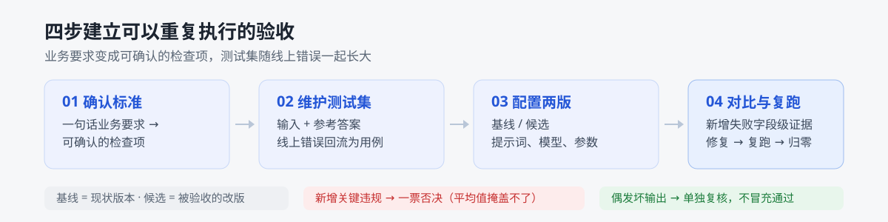

<div align="center">



[](LICENSE)


**改了提示词、换了模型 —— 哪些变好了？哪些被改坏了？这次改版值不值得采用？**

ChangeCheck 用同一套测试集对比新旧两版，以「新增失败优先」的报告定位本次改版引入的错误，并验证修复结果。


</div>

## 它是什么

个人开发者的 AI 功能（提取 / 分类 / 结构化输出）迭代很快，却是唯一一类**改完没有回归防护**的代码：输出不确定、无法断言，只能自己试两三条就上线。ChangeCheck 把 CI 拦坏代码的那道闸装到 AI 功能上：



- **业务要求 → 检查项**：一句话描述（"没写的必须留空，不能编"），生成可确认的检查项；确认后成为检查器真实读取的规则
- **测试集会长大的**：内置 36 条种子样例（正常 / 缺失 / 歧义 / 对抗）；线上发现坏输出，一键入库为回归用例
- **对比与守门**：基线 vs 候选逐条对比，每条可重复多次取多数决；偶发坏输出（解析失败 / 调用异常）单独复核

## 核心差异：新增失败优先

平均分上涨会掩盖新增退步——本工具按「新增」组织报告，而不是按总分：

| 传统评测 | ChangeCheck |
|---|---|
| 候选总分更高 → 采用 | 候选 27/36 → 36/36，但抓出 **11 条被多数决掩盖的新增关键违规** → 拒绝 |
| 整条样例通过 / 失败 | 字段级证据：违反哪条要求、期望 vs 实际、原文与两版输出对照 |
| 看不了就再跑一遍 | 退出码语义明确，CI 阻断 / 放行 / 复核 |

三态验收结论（建议采用 / 需复核 / 不建议采用）保留人工确认；判定口径 v0.6 含字段级关键违规对比、偶发坏输出闸门、语义反转防护（"取消提交报告" ≠ "提交报告"）。

## 快速开始

```bash
# 本地开发（无 key 也能用 mock 模式跑通全流程）
npm install && npm run dev          # http://localhost:3000

# 真实调用被测模型（DeepSeek，OpenAI 兼容协议，可换 GLM/Kimi/自建网关）
export DEEPSEEK_API_KEY=sk-xxx      # PowerShell: $env:DEEPSEEK_API_KEY='sk-xxx'
export DEEPSEEK_MODEL=deepseek-flash

# 一键部署（评审验证用）
docker compose up -d                # http://localhost:3000
```

首次打开自动播种三个演示任务（36 条样例 + 版本配置 + 四份历史报告）：**植入缺陷演示**、**盲测**（真实 API 跑出 8 条新增失败）、**混合案例**（mock：通过率更高但藏着关键违规 → 一票否决，修复版复跑归零）。原始运行记录见 [docs/evidence/](docs/evidence/)。

**做你自己的任务**：首页 →「＋ 新建验收任务」→ 定义字段 schema → 添加版本与样例 → 对比运行。

## 接入开发流程：CLI + CI 守门

Web 是同一内核的展示面；接进日常开发靠 CLI——验收标准与测试集以 JSON 存在你的仓库里，随代码版本化：

```bash
npm run cc -- init ./changecheck.json                # 生成配置脚手架
npm run cc -- run ./changecheck.json --mode mock     # mock 试跑
DEEPSEEK_API_KEY=sk-xxx npm run cc -- run ./changecheck.json --mode real   # 真实守门
```

**退出码语义（CI 守门的关键）**：`0`=无新增失败（允许还债式改进）｜`1`=新增关键违规（阻断合并）｜`2`=新增普通失败（需复核）｜`3`=调用大面积失败（结果不可信）。平均值上涨不放行新增退步——这正是本工具存在的意义。本仓库自己的 CI 就在用它（[changecheck-gate.yml](.github/workflows/changecheck-gate.yml)），参考 [example/support-ticket/](example/support-ticket/changecheck.json) 写你自己的配置。

## 环境变量

| 变量 | 默认 | 说明 |
|---|---|---|
| `DEEPSEEK_API_KEY` | 无 | 被测模型 API key，只经环境变量注入；缺失时仍可用 mock 模式 |
| `DEEPSEEK_BASE_URL` | `https://api.deepseek.com` | 任意 OpenAI 兼容端点 |
| `DEEPSEEK_MODEL` | `deepseek-flash` | 默认被测模型（可在版本配置里逐版本覆盖） |
| `CC_PRICE_IN` / `CC_PRICE_OUT` | `2` / `8` | 全局单价（元/百万 token）；换模型对比时建议按版本覆盖 |

## 开发

```bash
npm test        # 40 项单元测试（内核判定 / 要求解析 / CLI 接入与退出码）
npm run build   # 生产构建（CI 同款）
```

```
src/app        # Web 展示面：页面与 API 路由
src/lib/kernel # 内核三层：executor 执行器 / checker 检查器 / report 回归报告（UI 无关，CLI 共用）
src/lib        # db(SQLite) / seed(演示数据) / runs(运行编排) / requirements(要求引导)
cli/           # 接入层：changecheck CLI（配置即代码 + CI 守门）
m0/            # 验证实验存档（种子样例集来源）
```

## 文档

| 文档 | 内容 |
|---|---|
| [产品形态与演进](docs/product-vision.md) | 三层形态（Web / CLI/CI / MCP）、内核五层、战略判断 |
| [技术架构](docs/architecture.md) | 分层、数据模型、API、扩展口 |
| [效果证据](docs/evidence/) | 真实模型实验归档与报告导出（可独立复核） |
| [验证实验](m0/README.md) | Milestone 0：36 样例 × 2 版 × 3 次真实 API 验证 |

## License

[MIT](LICENSE) —— 最终采用决定保留人工确认。
