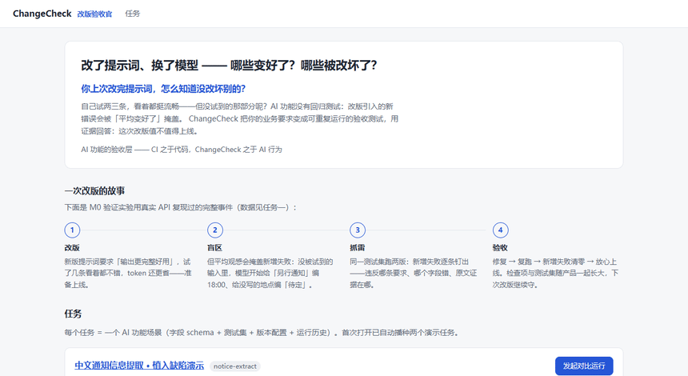

# ChangeCheck · 改版验收官

> 面向个人开发者的 AI 功能改版验收工具 —— 改了提示词、换了模型、调整流程之后，用证据回答：哪些变好了？哪些被改坏了？这次改版值不值得采用？



- **仓库名**：`changecheck`
- **中文名**：改版验收官（备选：`evaliff`、金丝雀/canary 隐喻）
- **参赛**：2026 上海开源软件应用创新大赛 · 开源 AI 工具赛道（自主选题）
- **提交截止**：2026-10-16 24:00（2026-10-09 官网复核，主赛事已顺延；见 docs/competition-facts.md）
- **当前阶段**：✅ 可提交版本（判定口径 v0.6）——自定义任务、Web + CLI/CI 双形态、38 项测试全过、CI 验收看门绿、Docker 从零复验、介绍 PDF 就绪
- **提交材料**：见 [docs/submission/checklist.md](docs/submission/checklist.md)（仓库/介绍 PDF/演示视频脚本）

## 快速开始

```bash
# 本地开发（无 key 也能用 mock 模式跑通全流程）
npm install && npm run dev          # http://localhost:3000

# 真实调用被测模型（DeepSeek，OpenAI 兼容协议，可换）
export DEEPSEEK_API_KEY=sk-xxx      # PowerShell: $env:DEEPSEEK_API_KEY='sk-xxx'
export DEEPSEEK_MODEL=deepseek-flash

# 一键部署（评审验证用）
docker compose up -d                # http://localhost:3000
```

首次打开自动播种三个演示任务（36 条样例 + 版本配置，即 M0 验证实验的可复现数据）：
**植入缺陷演示**（好心改版如何埋雷被抓，真实 API 数据）、**盲测**（"精简提示词省 token"的真实改版，结果未预埋，真实 API 跑出 8 条新增失败）、**混合案例**（mock 演示：候选通过率更高但藏着被多数决掩盖的关键违规 → 一票否决；再用修复版复跑确认清零——完整演示"发现退步→修复→复跑"闭环）。
历史运行原始记录（M0 真实跑 + 演示报告导出）见 [docs/evidence/](docs/evidence/)。

**做你自己的任务**：首页 →「＋ 新建验收任务」→ 定义字段 schema（任意"文本进、结构化 JSON 出"的 AI 功能）→ 添加版本与样例 → 对比运行。第一个字段约定为主体名称，验收时允许命名等价。

### 接入层：CLI + CI 守门（配置即代码）

Web 是同一内核的展示面；真正接进开发流程靠 CLI——验收标准与测试集以 JSON 存在你的仓库里，随代码版本化：

```bash
npm run cc -- init ./changecheck.json          # 生成配置脚手架（改样例和提示词）
npm run cc -- run ./changecheck.json --mode mock   # mock 试跑
DEEPSEEK_API_KEY=sk-xxx npm run cc -- run ./changecheck.json --mode real   # 真实守门
```

**退出码语义（CI 守门的关键）**：`0`=无新增失败（允许还债式改进）｜`1`=新增关键违规（阻断合并）｜`2`=新增普通失败（需复核）。平均值上涨不会放行新增退步——这正是本工具存在的意义。本仓库自己的 CI 就在用它（[.github/workflows/changecheck-gate.yml](.github/workflows/changecheck-gate.yml)，示例配置 mock 模式零成本）；参考 [example/support-ticket/](example/support-ticket/changecheck.json) 写你自己的配置。

### 环境变量

| 变量 | 默认 | 说明 |
|---|---|---|
| `DEEPSEEK_API_KEY` | 无 | 被测模型 API key，只经环境变量注入，不落库不进仓库；缺失时仍可用 mock 模式 |
| `DEEPSEEK_BASE_URL` | `https://api.deepseek.com` | 任意 OpenAI 兼容端点（GLM/Kimi/自建网关等） |
| `DEEPSEEK_MODEL` | `deepseek-flash` | 默认被测模型（可在版本配置里逐版本覆盖） |
| `CC_PRICE_IN` / `CC_PRICE_OUT` | `2` / `8` | 全局默认单价（元/百万 token）；换模型对比时建议在版本配置里按版本覆盖 |

### 开发

```bash
npm test        # 内核单元测试（检查器规则 / JSON 提取 / 报告聚合与结论）
npm run build   # 生产构建（CI 同款）
```

## 仓库结构

```
src/app        # 页面（任务/测试集/版本/运行报告）与 API 路由
src/lib/kernel # 内核三层：executor 执行器 / checker 检查器 / report 回归报告（UI 无关）
src/lib        # db.ts(SQLite) / seed.ts(种子) / runs.ts(运行编排)
m0/            # Milestone 0 验证实验（脚本版内核 + 种子数据来源，保留作复现）
docs/          # 项目文档（主文档 project-brief / 架构 / 产品愿景 / 赛事事实）
```

## 文档导航

| 文档 | 内容 |
|---|---|
| [docs/project-brief.md](docs/project-brief.md) | 项目主文档：背景、全部关键决策（D1–D7）、产品设计、排期、验证实验 |
| [docs/product-vision.md](docs/product-vision.md) | 完整产品形态：三层形态（Web/CLI/MCP）、五层内核、演进路线、战略判断 |
| [docs/architecture.md](docs/architecture.md) | v1 技术架构：分层、数据模型、API、内核与扩展口 |
| [docs/market-research.md](docs/market-research.md) | 市场调研：11 个同类产品 × 6 维度对比，四大空白与定位依据 |
| [docs/competition-facts.md](docs/competition-facts.md) | 赛事核实事实（截止时间、评审权重、奖项、材料要求，含来源） |
| [docs/submission/](docs/submission/checklist.md) | 提交材料：清单、介绍 PDF、演示视频脚本、试用记录模板 |
| [m0/README.md](m0/README.md) | Milestone 0 验证实验：怎么跑、回答什么问题、结论 |

## 给下一个会话的指引

1. 先读 `docs/project-brief.md`（含全部决策记录，不要重新讨论已定结论）。
2. 核对 `docs/competition-facts.md` 中的时间线是否仍然成立。
3. 待定事项见 project-brief §9（剩余：报名表确认 / 学生身份 / 中文名）。
4. 回退线：10/9 晚核心流程未跑通 → 放弃本工具，回退提交已有完成度的 AI 视频项目。
